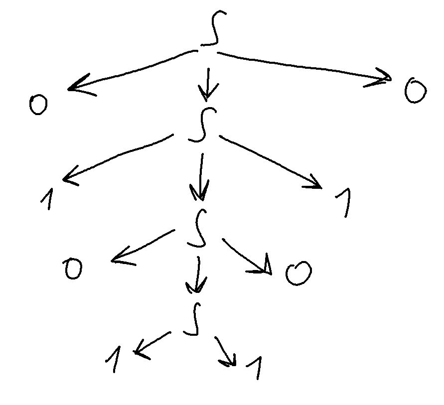

# HW01
1. 
`S -> 0S0 | 1S1 | ε`


Дерево вывода 01011010:




2. 

Сперва нужно применить n(возможно 0) первых правил для S и одно второе. Получим

```a^naTA^n```

Чтобы избавиться от всех A, нужно n раз применить ```TA -> bTa``` и сколько-то ``` aA -> Aa ```

```a^nab^nTa^n -> a^nab^nbaa^n```

Т.к. n может быть 0, то общий вид

```a^nb^na^n```

